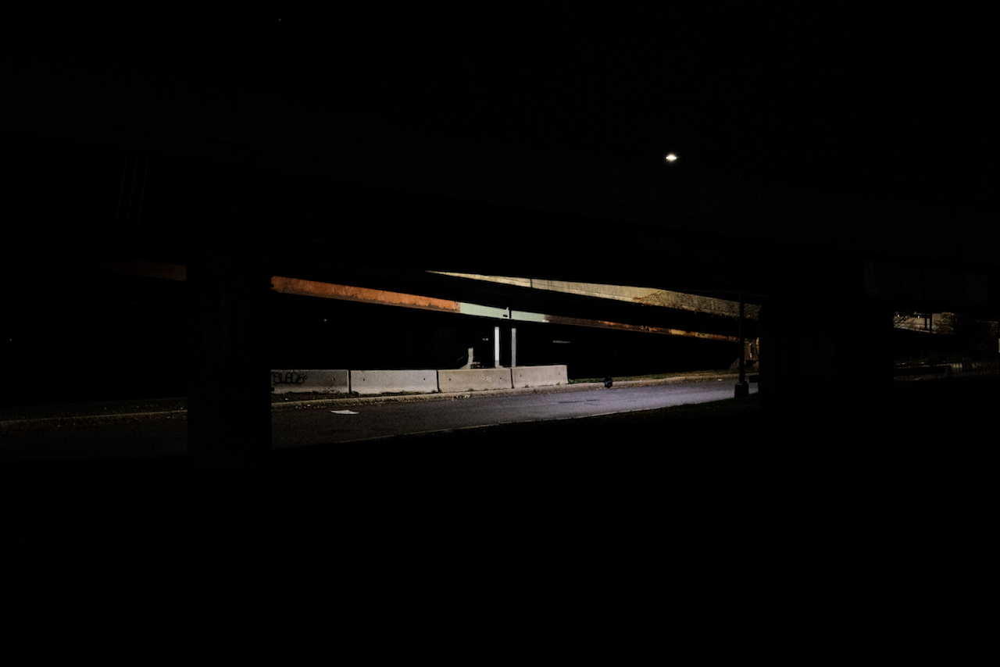
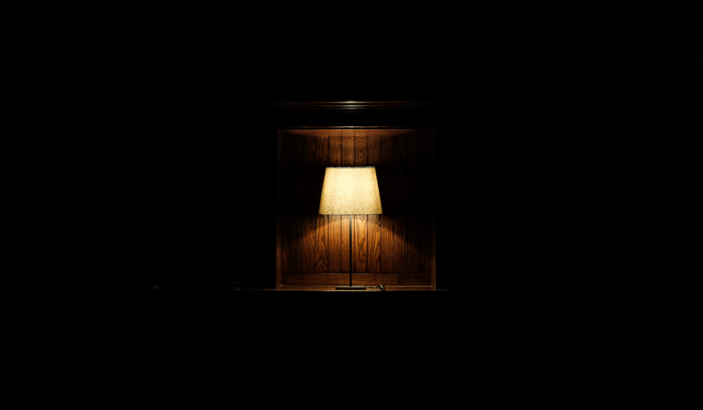
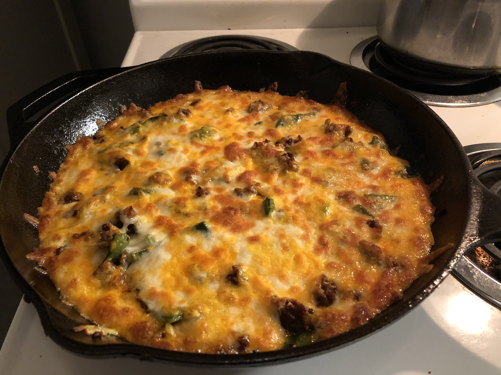
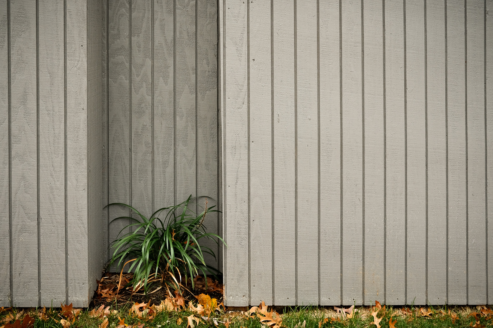
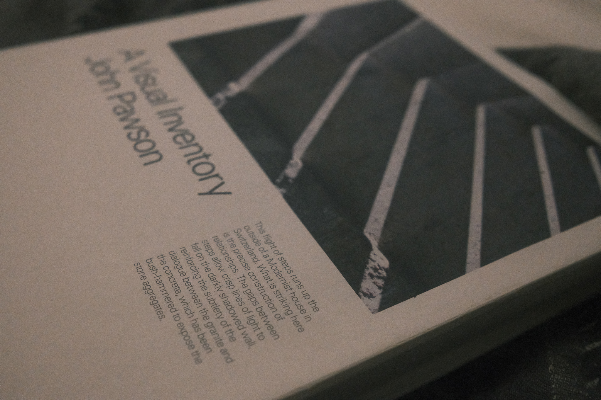
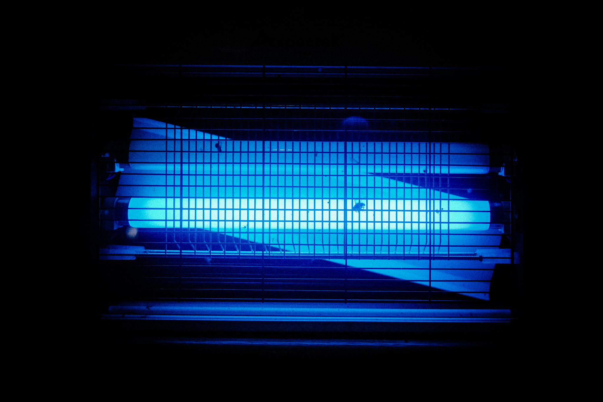
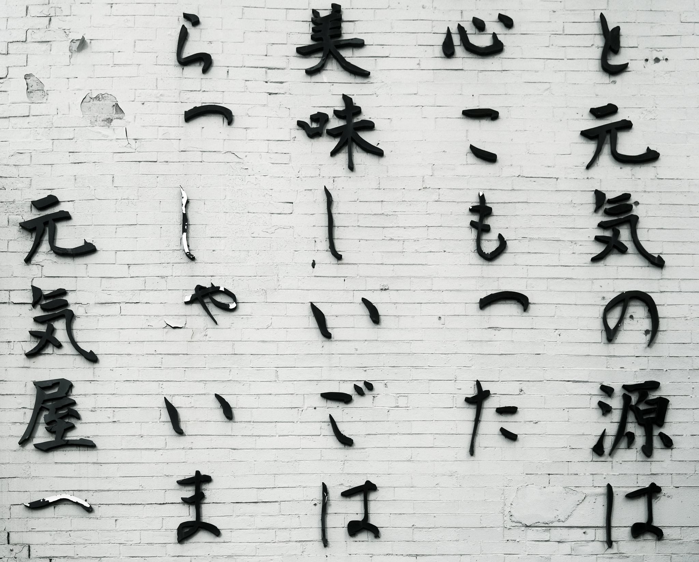
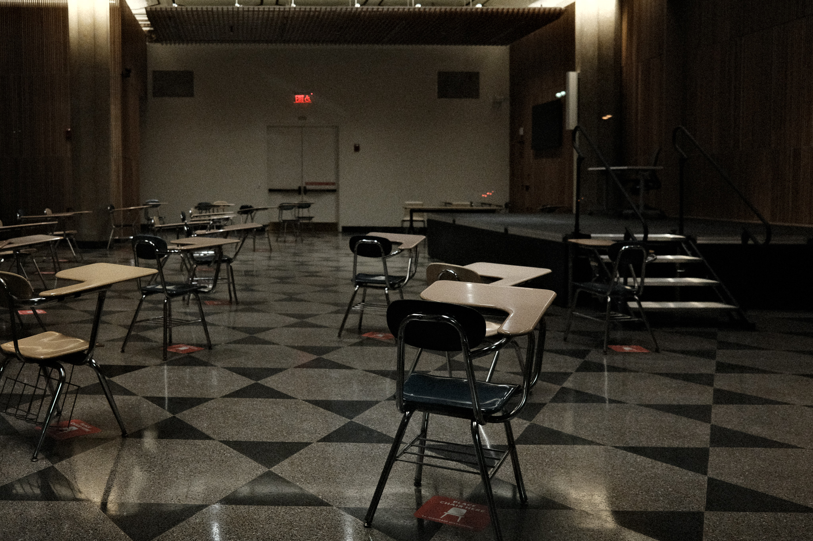
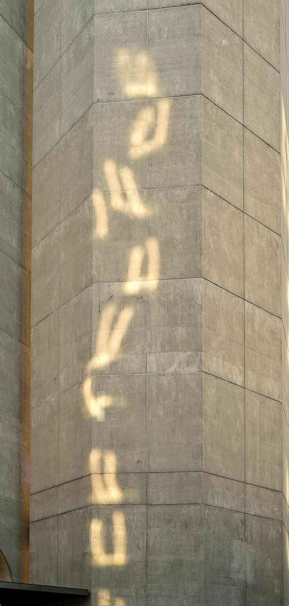

# pachinko road

Daily responses to Craig Mod's 2020 walk.

## 2020.11.03 . kamakura > totsuka > fujisawa

*How are you doing today?*

Reading from Boston after waking up early to vote. Nervous. A photograph from last night's walk captures some of this anxiety.

## 2020.11.04 . fujisawa > hiratsuka > oiso

*What beautiful, banal thing did you see today?*

At night, the simple Ikea lamp above my bed creates a little box of light that's perfect for reading myself to sleep.

## 2020.11.05 . oiso > odawara

*What did you see today that moved you?*

Curved windows opposite this alley wall in Back Bay focus glancing autumn sun into a keyhole of light.

## 2020.11.06 . odawara > hakone

*How are you doing today?*

Frustrated, impatient, annoyed, but mostly tired. Lots to be worried about, very little that actually matters.

## 2020.11.07 . hakone > mishima

*How are you doing today?*

The day looks bright, in sun and spirit. An afternoon for walking and catching up with old friends.

## 2020.11.08 . mishima > mishima > mishima

*How are you feeling right now?*

Energized and adventurous, but also just a little hungover.

## 2020.11.09 . mishima > namazu > hara > fuji

*How are you doing today?*

A weekend of quiet celebration continues with an impromptu day away from work, to walk the city and discover new places.

## 2020.11.10 . fuji > kambara > yui > okitsu

*How are you feeling today?*

Distracted. I find it increasingly difficult to do real work these days – it may be time to try something new.

## 2020.11.11 . okitsu > okitsu > okitsu

*How are you feeling today?*

It's amazing the difference just one 10-hour-sleep night can make.

## 2020.11.12 . okitsu > ejiri > fuchu

*What's happening? How tired are you?*

I've switched to tea for the past few days. A more subtle morning kick.

## 2020.11.13 . fuchu > mariko > okabe > fujieda

*What did you eat today?*

Queso fundido – poblanos, onions, chorizo, cheese – is a comfort classic. Too few places make it well, I prefer to do it myself.

## 2020.11.14 . fujieda > shimada

*How are you feeling today?*

Excited to see a couple friends and explore our old college campus.

## 2020.11.15 . shimada > kanaya > nissaka > kakegawa

*How are you feeling today?*

Ashamed after a day of overly-heavy drinking. Laying in bed, away from the world.

## 2020.11.16 . kakgawa > fukuroi > mitsuke > hamamatsu

*How are __you__ doing today?*

It's another regular work day here in Boston, getting colder but still not yet winter. Just passing time.

## 2020.11.17 . hamamatsu > hamamatsu > hamamatsu

*What do you do on a down day?*

Whether in a down mood or down on responsibilities, either way my go-to is finding something new. Like this wall of Japanese letters that seems like paper at thumbnail size, but reveals its physical texture on closer inspection.

## 2020.11.18 . hamamatsu > maisaka

*How are you doing today?*

Crazy how easy it is to go from bored and unchallenged to completely overwhelmed by work. Suddenly there is so much to do and not enough time to do it.

## 2020.11.19 . maisaka > arai > shirasuka > futagawa > yoshida

*How are you doing today?*

I haven't had to talk this much in months – I'm worried that I might forget how.

## 2020.11.20 . yoshida > goyu > akasaka > fujikawa > okazaki

*Think of a recent frustrating day; what beautiful moment was lodged in between the garbage?*

November 6. An email exchange with an author who wanted me to take down his content from a small personal project of mine. Within his rights, but in my opinion counterproductive. I forgot about it after seeing this typographic play of reflected light on the side of my favorite Brutalist building.

## 2020.11.21 . okazaki > okazaki > okazaki

*How are you doing today?*

